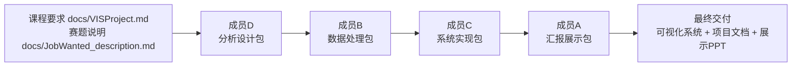

# 《职数洞见》招聘市场可视分析项目分工

## 1. 总体执行方式

本项目以 `docs/VISProject.md` 中的大作业要求为主，目标是完成“准备数据、设计并实现可视化工具/系统、提炼分析结果、课堂展示”的完整流程。`docs/JobWanted_description.md` 只作为招聘市场题目背景、字段说明和分析任务参考。

为了避免成员之间反复等待和返工，本项目采用单向流水线分工：

**成员D -> 成员B -> 成员C -> 成员A**

每位成员拿到上一位成员的交付包后，完成自己负责的一段工作，并把结果交给下一位成员。成员A作为组长可以做时间提醒和材料收集，但不作为中间返工节点参与“先A、再B、再A”的循环。

## 2. 工作顺序示意图

顺序说明：

1. 成员D先确定“要分析什么、要画什么、需要哪些数据”。
2. 成员B根据成员D的数据需求，一次性完成数据清洗、指标计算和聚合输出。
3. 成员C根据成员D的设计方案和成员B的数据结果，实现可视化系统和交互功能。
4. 成员A最后根据前三位成员的交付包，完成PPT、讲稿、展示流程和提交检查。

## 3. 大作业评分点对应负责人

| 大作业关注点 | 本项目对应工作 | 主要负责人 |
| --- | --- | --- |
| Data source processing and Data Mining 数据源处理和数据挖掘 | 清洗招聘数据，解析薪资，构造统计指标和洞见候选 | 成员B |
| Usage scenario 应用场景 | 明确招聘市场分析场景，设计系统服务对象和分析问题 | 成员D |
| Visualization design 可视化设计 | 设计系统视图、图表类型、视觉编码和分析流程 | 成员D |
| Interaction 交互 | 实现筛选、排序、tooltip、点击联动、指标切换等功能 | 成员C |
| Interesting insight from data 数据洞见 | 根据聚合结果输出可展示的数据发现 | 成员B，成员D提供口径 |
| 工具的可用性 | 完成可运行系统，保证界面清晰、演示稳定 | 成员C |
| 汇报展示 | 完成15页以内PPT、6分钟展示脚本和答辩准备 | 成员A |

## 4. 项目技术栈约定

| 工作环节 | 技术栈 / 工具 | 说明 |
| --- | --- | --- |
| 数据处理与数据挖掘 | Python、pandas、NumPy、scikit-learn、正则表达式 | 用于数据清洗、薪资解析、聚合统计、相似度计算和简单聚类分析。 |
| 数据存储与交换 | CSV、JSON | 原始数据保留为CSV，清洗后数据和前端聚合数据优先输出为JSON或CSV。 |
| 可视化系统实现 | Vue 3、Vite、TypeScript、ECharts | 用于搭建交互式Web可视化系统，ECharts负责主要图表和地图展示。 |
| 页面样式与交互 | CSS、ECharts交互配置 | 用于布局、颜色、图例、tooltip、筛选、排序、点击联动和指标切换。 |
| 设计与文档 | Markdown、Mermaid | 用于分析流程、顺序图、设计说明和项目文档。 |
| 协作管理 | Git、Markdown文档 | 用于版本管理、记录分工、保存数据处理说明和系统运行说明。 |

技术栈选择原则：

1. 数据分析以 Python 为主，保证数据处理过程可复现。
2. 前端系统以 Vue 3 + ECharts 为主，优先保证实现稳定和课堂展示效果。
3. 成员之间通过 CSV / JSON 文件交接，避免直接依赖对方代码环境。
4. 文档和设计说明统一使用 Markdown，关键流程图使用 Mermaid。

## 5. 四位成员具体分工

### 第一棒：成员D，分析设计负责人

负责方向：把课程要求和招聘题目转化成明确的分析方案，提前规定后续数据处理和系统实现要服务哪些问题。

使用技术栈 / 工具（仅供参考，实际工作中可灵活变通）：

- Markdown：编写分析问题、设计说明和项目文档。
- Mermaid：绘制分析流程、页面结构和工作顺序示意图。
- Excel / WPS表格：快速查看字段样例，整理前端数据需求表。

工作输入：

- `docs/VISProject.md`
- `docs/JobWanted_description.md`
- 原始字段信息：`job_title`、`city`、`salary`、`experience`、`education`、`company`、`company_type`

具体工作：

1. 确定3-4个主分析问题，例如薪酬差异、职位画像、地域招聘特征、行业/职位对比。
2. 为每个问题设计对应视图，例如市场总览、薪酬分析、职位画像、地域画像。
3. 明确每个视图使用什么图表，例如柱状图、箱线图、地图、散点图、热力图、雷达图等。
4. 制定数据需求表，写清楚每个视图需要的字段、聚合粒度和指标口径。
5. 设计数据洞见的判断口径，例如“高薪职位如何定义”“城市招聘活跃度如何衡量”“地域相似度需要哪些特征”。

具体产出：

- 分析问题清单
- 页面与图表设计说明
- 前端数据需求表
- 洞见判断口径说明

交付给下一棒：

- 成员B根据“前端数据需求表”和“洞见判断口径说明”处理数据。
- 成员C后续根据“页面与图表设计说明”实现系统。

### 第二棒：成员B，数据处理与数据挖掘负责人

负责方向：根据成员D的分析设计，一次性把原始招聘数据处理成可分析、可展示、可接入系统的数据包。

使用技术栈 / 工具（仅供参考，处理数据时可根据实际情况灵活选择）：

- Python：编写数据清洗和统计分析脚本。
- pandas：读取CSV、清洗字段、分组统计和导出结果。
- NumPy：辅助数值计算和异常值处理。
- scikit-learn：用于城市/职位相似度计算、简单聚类或标准化处理。
- 正则表达式：解析薪资字段，例如 `5-10K`、`5-10K·13薪`。
- CSV / JSON：输出清洗后数据和前端聚合数据。

工作输入：

- `data/JobWanted.csv`
- 成员D提供的分析问题清单
- 成员D提供的前端数据需求表
- 成员D提供的洞见判断口径说明

具体工作：

1. 检查原始数据规模、字段类型、缺失值、重复值和异常值。
2. 清洗无效薪资、缺失行业类别、异常城市、空字段等噪声数据。
3. 解析薪资字段，例如 `5-10K`、`5-10K·13薪`，生成最低薪资、最高薪资、平均月薪、估算年薪等字段。
4. 按城市、行业、职位、经验、学历等维度生成聚合统计数据。
5. 计算成员D要求的指标，例如招聘数量、平均薪资、中位薪资、薪资区间、热门职位、热门行业、城市招聘活跃度等。
6. 根据统计结果输出3-5条数据洞见候选，并附上对应的数据证据。

与成员D分析设计包对齐的细化任务：

1. 为页面A“市场总览”输出 KPI、Top 城市、Top 行业、薪酬分布、经验/学历占比数据。
2. 为页面B“薪酬模式分析”输出城市/行业薪资箱线图、城市-行业热力图、薪资散点图、经验/学历薪资分组数据。
3. 为页面C“职位画像”输出 Top 职位、职位薪酬排名、职位经验/学历要求分布、职位画像卡片数据。
4. 为页面D“地域画像”输出城市统计、城市雷达指标、相似城市列表、城市聚类编号和二维散点坐标。
5. 输出 `views/*.json` 页面级数据包，降低成员C接入前端时的二次加工成本。
6. 保留基础聚合文件，方便成员A在汇报中追溯洞见证据。

具体产出：

- 数据清洗脚本
- 清洗后数据集
- 聚合统计数据，例如城市统计、行业统计、职位统计、薪资分布统计
- 数据字段说明文档
- 数据质量处理说明
- 3-5条数据洞见候选及对应统计证据
- 页面级前端数据包：`overview_page.json`、`salary_patterns_page.json`、`job_profile_page.json`、`region_portrait_page.json`

交付给下一棒：

- 成员C直接使用清洗后数据和聚合统计数据实现可视化系统。
- 成员A最后使用数据质量说明和洞见候选编写PPT。

### 第三棒：成员C，可视化系统与交互负责人

负责方向：把成员D的设计方案和成员B的数据结果实现为一个可运行、可交互、可课堂展示的可视化系统。

使用技术栈 / 工具：

- Vue 3：搭建前端页面和组件结构。
- Vite：作为前端开发和构建工具。
- TypeScript：提高数据字段和组件调用的稳定性。
- ECharts：实现柱状图、折线图、散点图、箱线图、热力图、地图等主要可视化图表。
- CSS：完成页面布局、颜色、字体、图例和响应式适配。
- 浏览器开发者工具：调试数据加载、图表渲染和交互性能。

工作输入：

- 成员D提供的页面与图表设计说明
- 成员B提供的清洗后数据和聚合统计数据
- 成员B提供的数据字段说明文档

具体工作：

1. 搭建可视化系统页面框架。
2. 实现核心页面：市场总览、薪酬分析、职位画像、地域画像。
3. 接入成员B输出的数据文件，保证图表能稳定加载。
4. 实现交互功能，包括筛选、排序、悬停提示、点击联动、指标切换和重置。
5. 优化界面布局、颜色、字体、图例和响应速度，使系统适合课堂演示。

具体产出：

- 可运行的招聘市场可视分析系统
- 系统主要页面和图表组件
- 交互功能实现
- 系统运行说明
- 课堂展示用演示路径

交付给下一棒：

- 成员A根据系统截图、演示路径和功能说明制作最终PPT和讲稿。

### 第四棒：成员A，项目统筹与汇报负责人

负责方向：最后整合前三位成员的交付包，完成课程要求中的展示材料和最终提交检查。

使用技术栈 / 工具：

- PowerPoint / WPS：制作15页以内期末展示PPT。
- Markdown：整理汇报提纲、答辩问题和最终说明文档。
- 浏览器：运行并演示成员C完成的可视化系统。
- Git：检查项目文件是否完整，确认最终提交材料。

工作输入：

- 成员D提供的分析设计包
- 成员B提供的数据处理包
- 成员C提供的系统实现包
- `docs/VISProject.md` 中关于PPT、汇报时间和提交方式的要求

具体工作：

1. 汇总项目材料，统一项目名称、分析问题、图表命名和展示口径，并检查对接前面三个组员的完成内容。
2. 组织6分钟汇报故事线：应用场景、数据处理、可视化系统、交互设计、数据洞见。
3. 制作15页以内期末展示PPT。
4. 编写6分钟汇报稿或讲解提纲。
5. 准备答辩问题，例如选题意义、数据是否可靠、薪资如何解析、图表为什么这样设计、洞见是否有数据支撑。
6. 检查最终材料是否满足大作业要求。

具体产出：

- 期末展示PPT
- 6分钟汇报稿或讲解提纲
- 答辩问题准备清单
- 最终提交材料检查表
- 项目最终说明文档

最终交付：

- 可视化系统
- 数据处理材料
- 项目说明文档
- 期末展示PPT

## 6. 建议时间安排

| 顺序 | 成员 | 阶段目标 | 建议完成时间 |
| --- | --- | --- | --- |
| 1 | 成员D | 完成分析问题、图表设计和数据需求表 | 5月12日-5月17日 |
| 2 | 成员B | 完成数据清洗、指标计算和洞见候选 | 5月18日-5月24日 |
| 3 | 成员C | 完成可视化系统和交互演示路径 | 5月25日-6月2日 |
| 4 | 成员A | 完成PPT、讲稿、答辩准备和提交检查 | 6月3日-展示前 |

## 7. 一次性交付约定

1. 每位成员优先完成自己的交付包，不把未完成问题留给下一位成员猜。
2. 成员之间只保留单向交付关系：D交给B，B交给C，C交给A。
3. 最终汇报由成员A整合，但数据处理、系统实现、可视化设计和洞见证据分别保留对应成员署名，方便课堂问答时分工清晰。

